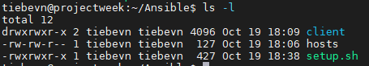
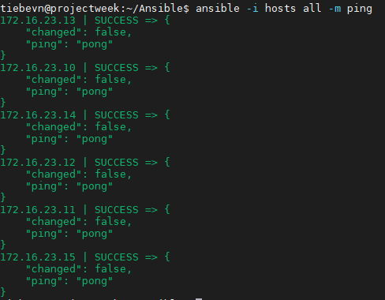
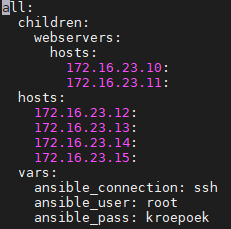

# Labo 4: Ansible

## Inleiding

### Ansible, wadisda?

Een van de grootste oorzaken van fouten in IT-infrastructuur is herhaling. Wanneer iemand een taak 1 keer moet doen, zal die persoon een stuk oplettender zijn dan wanneer hij/zij deze taak 100 keer moet doen. In IT zijn kleine foutjes snel gemaakt, al is het maar een typfout, en toch kunnen deze soms desastreuze gevolgen hebben. 

Ansible is een zeer krachtige tool gebruikt voor automatisatie van beheertaken. Het doel is zoveel mogelijk manuele taken te gaan automatiseren. Het idee is dat iedere taak die je normaal manueel zelf in een command line uitvoert, codeert in Ansible, en dat Ansible deze voor ons gaat uitvoeren. Deze taak testen we natuurlijk voordat we het op production loslaten, maar zo zijn we zeker dat er veel minder human errors in onze infrastructuur sluipen, en dat als we deze taak op andere servers moeten uitvoeren, de aanpak precies dezelfde is.

### Installatie ansible

Als eerste stap zal je uiteraard ansible moeten installeren. Dit is ook weer zeer eenvoudig, je installeert simpelweg het pakket 'ansible' van je packet manager.

```bash
# Ubuntu/Debian/...

sudo apt install ansible -y

# CentOS/Fedora/...

sudo yum install ansible -y
```

## Verkenning van de labo-omgeving

Voor de oefeningen maken we gebruik van een labomgeving in Docker. Deze is gelukkig voor jullie al voorbereid, en moet je enkel nog binnenhalen van https://github.com/Tiebevn/BS2_Labo4. In deze repository vind je een bestand 'setup.sh'. Dit voer je uit (`sudo ./setup.sh`).



Als we kijken in het bestand hosts, zien we hier de ip-adressen van de verschillende hosts, met enkele variabelen eronder die ansible gebruikt om verbinding te maken met de hosts. Hierover later meer.

Wanneer je alles goed hebt uitgevoerd kan je testen of je klaar bent om aan het labo te beginnen met het volgende commando:

```bash
ansible all -m ping
```

Als je output lijkt op de output hieronder, weet je direct of alles werkt.



In de standaardmap zitten aantal configuraties om het leven in Ansible gemakkelijker te maken. Dit maakt dat je de ansible-commando's best vanuit deze map aanroept, anders zullen bepaalde zaken niet goed werken.

## Inventory management

Bij het beheren van machines is het eerst en vooral belangrijk om een duidelijk en gestructureerd overzicht te hebben van alle machines. Hiervoor maken gebruik van de [Ansible Inventory](https://docs.ansible.com/ansible/latest/user_guide/intro_inventory.html).

Deze kan op 2 manieren gestructureerd worden: 
* INI: een ouder formaat, waarbij indentatie niet van belang is, enkel de volgorde
* YAML: een overzichtelijker formaat waarin indentatie de structuur bepaalt. Dit formaat ken je al van Docker-Compose files, we zullen dus ook dit formaat gebruiken.

In het huidige voorbeeld staan alle hosts verzameld onder de groep "all". In dit voorbeeld is "all" onze eerste groep. Iedere groep kan 3 attributen bevatten:
* children: Hier kunnen we eventuele child groups onder plaatsen
* hosts: Hier plaatsen we de hosts die rechtstreeks onder de groep vallen
* vars: Hier plaatsen we de variabelen die rechtstreeks aan de groep gekoppeld zijn.



Probeer nu zelf een 2e groep, op het zelfde niveau als de groep webservers aan te maken met de 3e en 4e host, en noem deze groep databases.

Je kan testen of je groepen werken door het ping-commando van de inleiding te nemen en all te vervangen door de groepnaam. Je kan eventueel ook extra inventaris-bestanden aanmaken (bijvoorbeeld voor staging en production). Met de parameter -i kan je een eigen hosts file meegeven.

Er is nooit 1 ideale oplossing om je inventaris op te bouwen, daarom is het belangrijk een duidelijke structuur te hanteren. Meer info en voorbeelden van de Ansible Inventory vind je uiteraard in de documentatie.

## Ons eerste playbook

Nu onze hosts gestructureerd zijn, kunnen we er taken op beginnen uitvoeren. Deze taken gaan we beschrijven in een playbook. Een playbook is een YAML-gestructureerd bestand waarin we de verschillende stappen die moeten gedaan worden om een taak te doen beschreven staan.

Dit is een zeer eenvoudig voorbeeldje van zo'n playbook. Bovenaan zeggen we dat dit op alle hosts van de group webserver uitgevoerd moet worden. In de eerste stap maken we een bestand met de naam hello.txt, in de tweede stap laten we de inhoud van de directory oplijsten.

Om dit playbook uit te voeren slaan we onderstaande tekst op in een bestand, en voer je het uit met het commando `ansible-playbook my_first_playbook.yml`.
```yaml
- hosts: webservers
  tasks:
    - name: Create a file
      command: touch /root/hello.txt
    
    - name: Show the directory content
      command: ls /root
```

Wanneer je dit uitvoert zullen er 2 zaken opvallen:


Eerst en vooral zal je merken dat je de directory-inhoud van de map niet getoond wordt zoals verwacht. Dit is simpelweg omdat Ansible de output van commando's niet zal tonen (tenzij er een error is). Moest je dit om 1 of andere reden toch willen kunnen, moet je een debug-output specifiëren in je playbook, maar daar houden we ons in dit labo niet mee bezig.

Ten tweede zie je een waarschuwing:

```
[WARNING]: Consider using the file module with state=touch rather than running touch...
```

Ansible vertelt ons dat er een betere manier is om het behandelen van bestanden aan te pakken, namelijk met een module. Modules zijn in essentie plugins/libraries, die het uitvoeren van bepaalde taken eenvoudiger maken/faciliteren. In het begin van  het labo gebruikten we de ping-module, in dit playbook gebruikten we command-module, maar er zijn er [ENORM veel](https://docs.ansible.com/ansible/2.8/modules/list_of_all_modules.html), gaande van simpele modules om bestanden aan te maken tot complexe modules om zeer specifieke configuraties te gaan doen op een specifiek merk van firewall. Deze modules zijn ook community-driven, wat wil zeggen dat er voortdurend mensen zijn die voor hun eigen noden modules ontwikkelen en die delen met de wereld.

In ons geval raadt Ansible ons aan om de [file-module](https://docs.ansible.com/ansible/2.8/modules/file_module.html#file-module) te gebruiken.

```yaml
- hosts: webservers
  tasks:
    - name: Create a file
      file:
        path: /root/mysecondfile.txt
        state: touch
```
Je kan nu met ssh in je container gaan (user root, wachtwoord kroepoek) en kijken of de bestanden effectief bestaan.

Nu je weet hoe modules, probeer eens met de [copy-module](https://docs.ansible.com/ansible/2.8/modules/copy_module.html#copy-module) een bestand van je Ansible Server naar 1 van de hosts te kopiëren.

Je kan uiteraard ook meerdere modules combineren in 1 playbook, en daar ligt de kracht van ansible. Onderstaand playbook is een voorbeeld om een eenvoudige webserver te installeren.

```yaml
- hosts: webservers
  tasks:
    - name: Install Nginx
      apt: name=nginx state=latest

    - name: start nginx
      service:
        name: nginx
        state: started

    - name: copy custom index-files
      copy:
        src: ./index.html
        dest: /var/www/html/index.html
```

Met alles wat je ondertussen al geleerd hebt, probeer nu eens zelf op de daarvoor voorziene hosts een MySQL-server te installeren.

## Playbooks: the advanced stuff

### Variabelen

In onze playbooks kunnen we variabelen maken, en deze gebruiken in onze playbooks:

```yaml
- hosts: webservers

  vars:
    - usergroup: www-data
    - users:
        - admin
        - user1
        - user2

  tasks:
    - name: Create user
      user:
        name: "{{ item }}"
        state: present
        groups: "{{ usergroup }}"
      loop: "{{users}}"
```

In bovenstaand voorbeeld maken we 2 variabelen:
* usergroup: dit is de group waar de users aan toegevoegd zullen worden
* users: een lijst van de users die we willen toevoegen

Wanneer je dit playbook uitvoert zal je zien dat de 'Create User' task herhaald wordt voor iedere user (dankzij de loop-functionaliteit), en deze altijd in de juiste usergroup wordt geplaatst.

We kunnen ook dynamisch variabelen registreren. In dit voorbeeld vragen we de inhoud op van het bestand `/etc/motd` en schrijven we het weg naar de variabele `cmd_result`. In de volgende 2 taken wordt er gekeken naar de inhoud van die variabele, en op basis daarvan wordt de stap al dan niet uitgevoerd.

```yaml
- hosts: webservers
  tasks:
    - name: create a motd
      file:
        path: /etc/motd
        state: touch

    - name: Registering a variable
      shell: cat /etc/motd
      register: cmd_result

    - name: It didnt say hi
      shell: echo 'hi' > /etc/motd
      when: cmd_result.stdout.find('hi') == -1

    - name: It said hi
      shell: echo 'bye' > /etc/motd
      when: cmd_result.stdout.find('hi') != -1
```

#### Oefening 1
Maak een playbook waarin je met een loop de volgende bestanden aanmaakt:
* passwords.txt
* schattigekatjes.jpg
* cosci_prices.xlsx

Al deze files zijn eigendom van de user en group root, met de rechten 660.

#### Oefening 2
Controleer hoeveel bestanden er in /root staan. Als er meer dan 5 bestanden staan, maak je de map volledig leeg.

### Ansible facts

Naast al die variabelen houdt Ansible ook een heleboel eigen variabelen bij: [Ansible facts](https://docs.ansible.com/ansible/latest/user_guide/playbooks_vars_facts.html#vars-and-facts).

Wanneer je het commando `ansible <hostname> -m setup` uitvoert, krijg je een hele lange lijst van alle variabelen die Ansible verzamelt. Dit gaat van informatie over het besturingssysteem tot het ip-adres van de netwerkadapter, en de serienummers van de schijven die zijn aangesloten... kortom, een heleboel. Deze variabelen kan je ook gebruiken in je playbooks, zoals onderstaand voorbeeld, waarin alle machines met CentOS 6 worden afgesloten.

```yaml
tasks:
  - name: Shut down CentOS 6 systems
    ansible.builtin.command: /sbin/shutdown -t now
    when:
      - ansible_facts['distribution'] == "CentOS"
      - ansible_facts['distribution_major_version'] == "6"
```

## Collections

Ten slotte nog iets leuk:

Net zoals Docker een community heeft waar een heleboel images op gedeeld worden, heeft ook Ansible een platform waarop een heleboel playbooks gedeeld worden: [Ansible Galaxy](https://galaxy.ansible.com/). Kijk hier zeker ook eens rond wat je allemaal terug vindt.